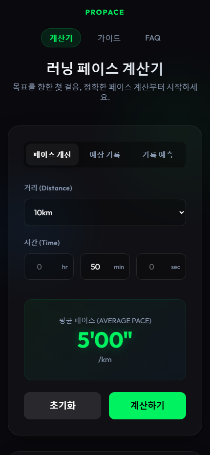
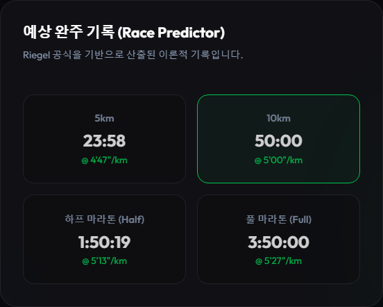

# ProPace · 러닝 페이스 계산기

거리·시간·페이스를 입력해 목표 페이스와 예상 소요 시간을 계산하는 웹 앱입니다. 최근 기록을 다른 거리의 기록으로 환산하고, 일정한 페이스로 달릴 때의 구간 통과 시간을 확인할 수 있습니다.

[ProPace 열기](https://propace.site/)

## 주요 기능

| 모드·기능 | 입력 | 결과 |
| --- | --- | --- |
| 페이스 계산 | 거리와 완주 시간 | 평균 페이스 |
| 예상 기록 | 거리와 페이스 | 예상 소요 시간 |
| 기록 예측 | 기준 거리·최근 기록·러너 타입 | 5km·10km·하프·풀 예상 기록 |
| 구간 기록표 | 페이스·예상 기록 모드의 계산 결과 | 1km 또는 5km 단위 누적 시간 |
| 거리 선택 | 5km·10km·하프·풀 또는 직접 입력 | 선택 거리에 맞춰 계산 |
| 안내 페이지 | 가이드·FAQ 메뉴 | 러닝 관련 안내 |
| 의견 보내기 | 이메일(선택)·내용 | Formspree로 의견 전송 |

회원가입이나 계산용 서버 없이 브라우저에서 계산합니다.

## 계산 방식

시간은 초, 거리는 km로 변환해 계산합니다.

| 계산 | 공식 |
| --- | --- |
| 페이스 | 전체 시간 ÷ 거리 |
| 소요 시간 | 페이스 × 거리 |
| 구간 누적 시간 | 구간 도착 거리 × 페이스 |
| 다른 거리의 기록 | T₂ = T₁ × (D₂ / D₁)ᵏ |

기록 예측은 코드에 구현된 Riegel 공식을 사용합니다. 러너 타입 선택에 따라 지수 k를 일반 1.06, 스피드형/초급 1.10, 지구력형 1.03으로 설정합니다. 개인 기록으로 자동 학습하거나 보정하는 기능은 아닙니다.

예를 들어 **10km를 50분에 달리려면 5분/km**이고, 같은 페이스의 5km 통과 시간은 25분입니다. 구간 기록표는 일정한 페이스를 가정하며, 출력 시간은 초 미만을 버립니다.

## 실행 화면

2026-10-02 실제 배포 페이지에서 **10km·50분**을 입력해 캡처했습니다. 의견 전송은 실행하지 않았습니다.

<details>
<summary>PC 계산 화면 펼쳐보기</summary>


</details>

<details>
<summary>모바일 계산 화면 펼쳐보기</summary>

<p align="center">
  
</p>

PC Chromium의 430px 모바일 폭 캡처입니다.

</details>

<details>
<summary>거리별 기록 예측 화면 펼쳐보기</summary>



기준 기록 10km·50분에 일반 러너 지수 1.06을 적용한 이론적 계산 결과입니다.

</details>

## 아키텍처


- index.html과 style.css가 입력 폼·탭·결과 영역을 구성합니다.
- app.js가 입력을 읽고 계산한 뒤 결과·구간표·예측 카드를 DOM에 표시합니다.
- firebase.json에는 public 폴더를 제공하는 Firebase Hosting 설정이 있습니다.
- 계산 로직에는 외부 계산 API 호출이 없습니다.
- 의견 제출은 Formspree에 POST 요청을 보냅니다.
- 페이지에는 Google Analytics, Microsoft Clarity, AdSense 스크립트도 포함되어 있습니다. ‘브라우저에서 계산’은 외부 통신이 전혀 없다는 뜻은 아닙니다.

## 파일 구성

| 파일 | 역할 |
| --- | --- |
| [public/index.html](./public/index.html) | 계산 화면, 의견 폼, 메타데이터 |
| [public/app.js](./public/app.js) | 계산·모드 전환·구간표·기록 예측·의견 전송 |
| [public/style.css](./public/style.css) | 공통 디자인과 반응형 스타일 |
| [public/guide.html](./public/guide.html) | 러닝 가이드 |
| [public/faq.html](./public/faq.html) | FAQ |
| [public/privacy.html](./public/privacy.html) | 개인정보처리방침 |
| [public/sitemap.xml](./public/sitemap.xml), [public/robots.txt](./public/robots.txt) | 검색엔진 관련 파일 |
| [firebase.json](./firebase.json) | 정적 호스팅 설정 |

기술은 **HTML·CSS·Vanilla JavaScript**입니다. 프레임워크, package.json, 별도 빌드 과정은 없습니다.

## 로컬 실행

저장소를 내려받고 Python이 설치된 환경에서 실행합니다.

```bash
git clone https://github.com/jaehyeok-99/product-builder.git
cd product-builder
python -m http.server 8000 --directory public --bind 127.0.0.1
```

브라우저에서 `http://localhost:8000`을 엽니다. public/index.html을 직접 열어 계산 화면을 확인할 수도 있습니다.

public에는 외부 서비스 식별자와 Formspree 전송 주소가 들어 있습니다. 다른 용도로 복제해 운영한다면 이 설정과 도메인 링크, 정책 문서를 해당 운영 환경에 맞게 변경해야 합니다.

## 확인한 동작과 현재 범위

배포 페이지의 PC·모바일 폭에서 다음을 확인했습니다.

- 10km·50분 → 5분/km
- 10km·5분/km → 50분
- 1km 구간표 10행, 5km 구간표 2행
- 기록 예측 카드 4개와 기준 거리의 50분 결과
- 확인 과정에서 JavaScript 실행 오류 없음

날씨·고저차·컨디션을 반영하는 모델이나 주행 기록 저장 기능은 없습니다. 기록 예측은 입력과 선택한 지수에 따른 수학적 환산값입니다. 외부 의견 전송, 광고·분석 수집, 모든 입력 경계값을 검증한 결과는 아닙니다.
